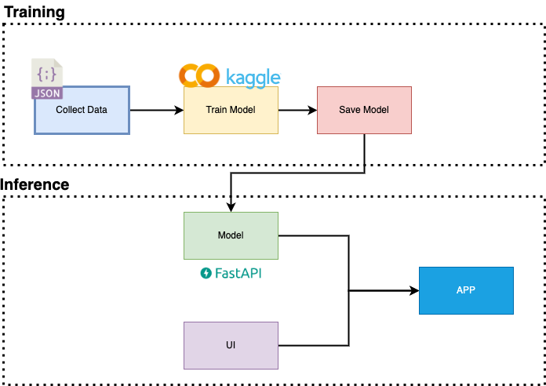

[](https://colab.research.google.com/drive/1QIOEfsB7DPcPRp9VX3fK2yg6atybkHvq#scrollTo=Bsy56wuXOPg1)

# GPT Wrapper for KMS Technical Challenge

> by tsdocode from CoE




## Resources
Use KMS email to access resources

[Pretrained model](https://drive.google.com/drive/folders/11aWe3IZ0pfxujwzsFHwSzgJuAlPryBNs?usp=sharing)

[Sample Dataset](https://drive.google.com/drive/folders/1eQ6T2AGa5-1UXZfNwE3HdrOpWwXZKttu?usp=sharing)

Checkout [FastAPIxStreamlit](https://github.com/tsdocode/GPT-Example) example


## **1. Installation**

**1.1 Install Miniconda**

Follow this [instruction](https://docs.conda.io/en/latest/miniconda.html#) to install miniconda.
Skip it if you using Google Colab or sth else.

If you using Google Colab, please add **!** symbol before instruction below

Example:
```python
!pip install -r requirements.txt
```


**1.2 Install Library**
```
git clone https://github.com/tsdocode/gpt-wrapper.git
cd gpt-wrapper
pip install -r requirements.txt
```


## **2. Data preparing**
Sample data format
```json
{
    'data' : [
        {
            'schema' : "",
            'question' : "",
            'sql' : ""
        },
        {
            'schema' : "",
            'question' : "",
            'sql' : ""
        }

    ]
}
```

Collect and annotate your data with this format.

## **3. Turn json dataset into trainable txt**
```python
python dataset.py -i <input_file> -o <output_file>
```

if you don't provide --output-file, file name will be the same as --input-file

You can also custom txt dataset by modify **make_prompt()** function in dataset.py

## **4. Train GPT**
```python
python trainer.py -i <input_data> -o <output_model_folder> -m <model_name> -p <pretrained_model_path> -e <epochs> -l <learning_rate>  
```
default:
- model_name: 125M
- epochs: 1
- learning_rate: 5e-5

if you want to continued training from a previous model, you can use -p to specify the path of the previous model. 

## **5. Inference**
```python
from model import GPTModel

#Define custom preprocess and postprocess
#You can also edit default function in utils.py
def preprocessing(schema, question):
    #Feel free to custom input prompt
    prompt = f"{schema} \n {question} \n"
    return prompt

def postprocessing(result):
    return result


text_to_sql = GPTModel(model_path='/path/to/model/')

schema = ""
question = ""

SQL = text_to_sql.generate(schema, question, preprocessing, postprocessing)
print(SQL)
```

## **6. Eval**
Coming soon...


